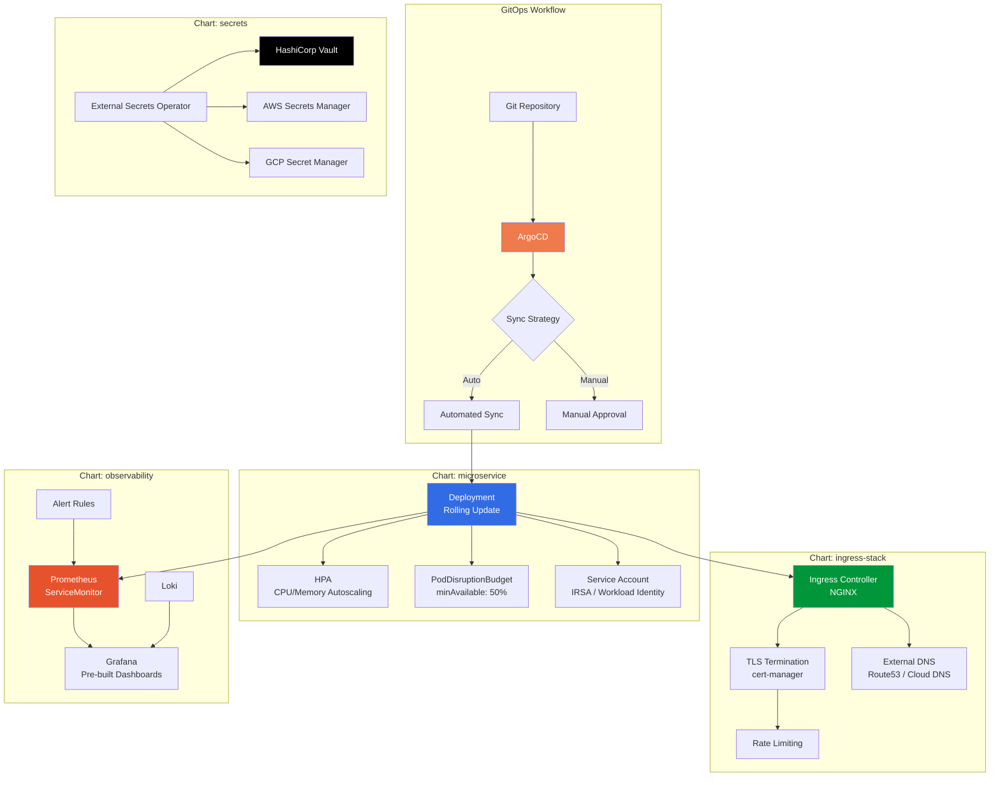

<div align="center">

# Kubernetes Helm Charts

**Production-grade Helm charts for real-world Kubernetes deployments**

[](https://kubernetes.io/)
[](https://helm.sh/)
[](https://argoproj.github.io/cd/)
[](LICENSE)
[](https://devopsdispatch.beehiiv.com)

*Battle-tested in EKS, GKE, and OpenShift clusters across MENA enterprise environments.*

</div>

---

## The Problem

Most Helm charts from the internet are either too simple for production or too complex to understand. You need charts that handle the realities of enterprise Kubernetes: resource limits, pod disruption budgets, network policies, health checks, and multi-environment values.

These charts are extracted from clusters I've managed in banking, telecom, and government where "it works on my machine" isn't an answer.

---

## Architecture Overview



---

## Charts

| Chart | Description | Key Features |
|-------|-------------|--------------|
| `microservice` | Generic microservice deployment | HPA, PDB, health probes, IRSA/WI, resource quotas |
| `cronjob` | Scheduled batch jobs | Concurrency policies, history limits, failure handling |
| `ingress-stack` | NGINX Ingress + cert-manager + ExternalDNS | TLS automation, rate limiting, WAF annotations |
| `observability` | Prometheus + Grafana + Loki stack | Pre-configured dashboards, alert rules, ServiceMonitors |
| `secrets` | External Secrets Operator config | Vault, AWS SM, GCP SM backends |

---

## Quick Start

### 1. Add the chart repo (or clone)

```bash
git clone https://github.com/maziz00/k8s-helm-charts.git
cd k8s-helm-charts
```

### 2. Deploy a microservice

```bash
# Review default values
cat charts/microservice/values.yaml

# Install with custom values
helm install my-api charts/microservice \
  -f my-values.yaml \
  -n my-namespace \
  --create-namespace
```

### 3. Example values file

```yaml
# my-values.yaml
replicaCount: 3

image:
  repository: registry.gitlab.com/myorg/my-api
  tag: "v1.2.0"

resources:
  requests:
    cpu: 250m
    memory: 256Mi
  limits:
    cpu: 500m
    memory: 512Mi

autoscaling:
  enabled: true
  minReplicas: 3
  maxReplicas: 15
  targetCPUUtilization: 70

ingress:
  enabled: true
  className: nginx
  hosts:
    - host: api.example.com
      paths:
        - path: /
          pathType: Prefix
  tls:
    - secretName: api-tls
      hosts:
        - api.example.com

healthCheck:
  liveness:
    path: /healthz
    initialDelaySeconds: 15
  readiness:
    path: /ready
    initialDelaySeconds: 5

podDisruptionBudget:
  enabled: true
  minAvailable: "50%"
```

---

## ArgoCD Integration

Every chart is designed to work with ArgoCD out of the box.

```yaml
# argocd-application.yaml
apiVersion: argoproj.io/v1alpha1
kind: Application
metadata:
  name: my-api
  namespace: argocd
spec:
  project: default
  source:
    repoURL: https://github.com/maziz00/k8s-helm-charts.git
    targetRevision: v1.0.0
    path: charts/microservice
    helm:
      valueFiles:
        - ../../environments/production/my-api.yaml
  destination:
    server: https://kubernetes.default.svc
    namespace: production
  syncPolicy:
    automated:
      prune: true
      selfHeal: true
```

---

## Multi-Environment Values

Each chart supports per-environment value overrides:

```
environments/
├── staging/
│   ├── my-api.yaml          # 1 replica, debug logging
│   └── worker.yaml
├── production/
│   ├── my-api.yaml          # 3 replicas, HPA, PDB
│   └── worker.yaml
└── base/
    └── common.yaml           # Shared across all envs
```

---

## Project Structure

```
k8s-helm-charts/
├── charts/
│   ├── microservice/
│   │   ├── Chart.yaml
│   │   ├── values.yaml
│   │   ├── templates/
│   │   │   ├── deployment.yaml
│   │   │   ├── service.yaml
│   │   │   ├── ingress.yaml
│   │   │   ├── hpa.yaml
│   │   │   ├── pdb.yaml
│   │   │   ├── serviceaccount.yaml
│   │   │   ├── servicemonitor.yaml
│   │   │   └── _helpers.tpl
│   │   └── tests/
│   ├── cronjob/
│   ├── ingress-stack/
│   ├── observability/
│   └── secrets/
├── environments/
│   ├── staging/
│   ├── production/
│   └── base/
├── LICENSE
└── README.md
```

---

## What Makes These Different

- **Resource limits on everything** no unbounded pods eating your cluster
- **PodDisruptionBudgets by default** safe node draining during upgrades
- **Health probes configured** liveness, readiness, and startup probes with sane defaults
- **ServiceMonitor included** Prometheus scraping works out of the box
- **Network policies** optional but included templates for namespace isolation
- **IRSA / Workload Identity** cloud IAM integration without node-level service accounts

---

## Author

**Mohamed AbdelAziz** — Senior DevOps Architect
12 years managing Kubernetes clusters from 3-node dev clusters to 200-node production fleets.

- [LinkedIn](https://www.linkedin.com/in/maziz00/) | [Medium](https://medium.com/@maziz00) | [Upwork](https://www.upwork.com/freelancers/maziz00?s=1110580753140797440) | [Consulting](https://calendly.com/maziz00/devops)
---

## License

MIT — use freely in your clusters. Star the repo if it saved you time.
